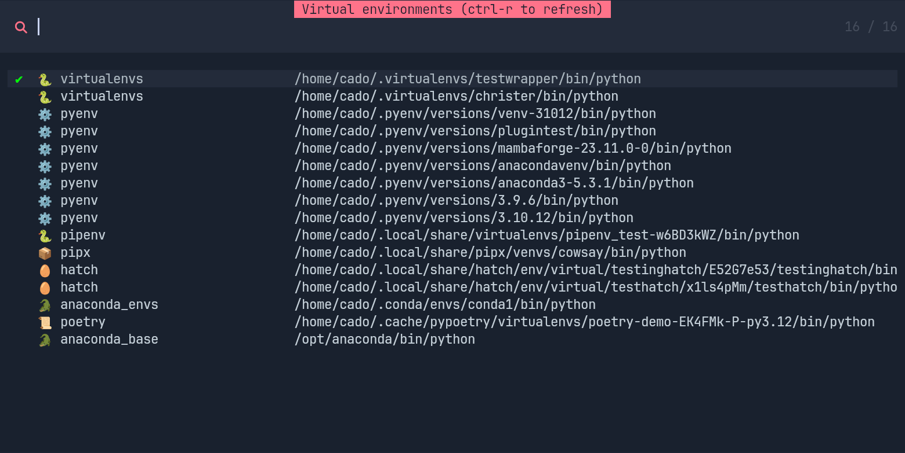

# 🎉 Python Venv Selector

<p align="center">
  
</p>

A small Neovim plugin to browse and activate Python virtual environments inside Neovim.  
This repository now keeps the README concise and forwards detailed usage, configuration, and API documentation to the `docs/` folder.

---

Quick links
- Usage / installation / examples: `docs/USAGE.md`
- Full configuration reference: `docs/OPTIONS.md`
- Public API and helper functions: `docs/API.md`
- Long-form examples (statuslines, callbacks): `examples/`
- Release notes / recent news: `CHANGELOG.md`

---

Why this README is short
- The README now acts as a quick index and entrypoint.
- All usage examples, detailed configuration options, and API references were moved into the `docs/` folder so they can be maintained independently and consumed by docs tooling or the website.

---

Quick Start (very short)
1. Ensure prerequisites:
   - `fd` (or `fdfind`) available in your PATH
   - A picker plugin: one of `telescope`, `fzf-lua`, `snacks`, `mini-pick`, or use the native picker
2. Install the plugin with your plugin manager (see `docs/USAGE.md` for detailed instructions and examples).
```lua
{ "linux-cultist/venv-selector.nvim", ft = "python", keys = { { ",v", "<cmd>VenvSelect<cr>" } } }
```
3. Open a Python file, trigger the picker (default keymap often shown in docs, e.g. `,v`), and select a venv to activate.

For complete installation examples, keymaps, picker configuration and per-search examples, open:
- `docs/USAGE.md`

---

Requirements
- Neovim >= 0.11 (see `CHANGELOG.md` for rationale).
- `fd` (or a compatible substitute) for default searches. You can replace default searches with other commands.
- A supported picker (see docs for details).
- Optional: `nvim-dap`, `nvim-dap-python`, and `debugpy` for debugger integration.

---

Where to look for details

- docs/USAGE.md
  - Full install examples (lazy.nvim, packer, etc.)
  - How to set up keymaps and lazy-loading
  - How to add/override searches, with examples using `fd`, `find`, and `uv` (PEP-723)
  - Troubleshooting common issues (venvs not showing, performance, conda notes)

- docs/OPTIONS.md
  - Complete list of global options, picker options, and configuration knobs
  - Examples for common customizations (on_telescope_result_callback, statusline_func, picker customization)

- docs/API.md
  - The public functions available via `require("venv-selector")` (e.g. `python()`, `venv()`, `source()`, `activate_from_path(...)`)
  - Example usage patterns for statuslines, callbacks, and automation

- examples/
  - Practical example files you can copy into your config: statusline helpers, callback helpers, and more.

- CHANGELOG.md
  - Recent releases and important notes (minimum Neovim version, new features, breaking changes).

---

Contributing
- Please read `CONTRIBUTING.md` (if present) before opening issues or PRs.
- Smaller, focused PRs with tests/examples are easier to review.
- If you want documentation changes, update `docs/*` and add or update examples under `examples/`.

License
- See `LICENSE` for license information.

---

If you prefer, I can:
- Move any remaining inline usage examples from this README into `docs/USAGE.md`.
- Add a short "Getting started" snippet that is small enough to keep the README brief while still showing a one-line lazy.nvim example.
- Add badges (CI, docs, release) at the top.

Please tell me which follow-up action you'd like me to take.