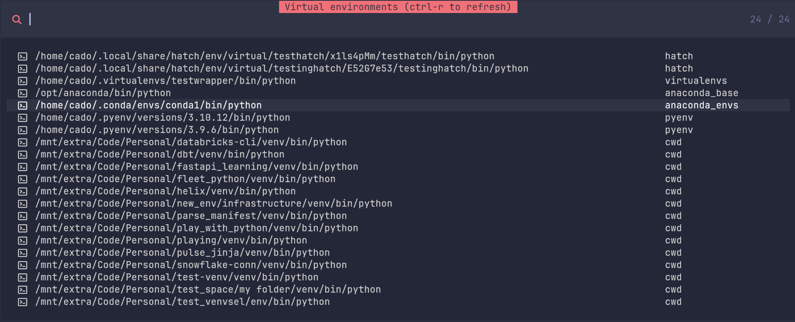

<p align="center">
  <h1 align="center">:tada: Python Venv Selector</h2>
</p>

<p align="center">
	A simple neovim plugin to let you choose what virtual environment to activate in neovim.
</p>

<p align="center">
    
</p>

# ⚡️ Features

- Switch back and forth between virtual environments without restarting neovim
- New and much more flexible configuration to support finding the exact venvs you want.
- Browse existing python virtual environments on your computer and select one to activate inside neovim.
- Supports **all** virtual environments using configurable **regular expressions**. The default ones are:
  - [Python](https://www.python.org/) (`python3 -m venv venv`)
  - [Poetry](https://python-poetry.org)
  - [Pipenv](https://pipenv.pypa.io/en/latest/)
  - [Anaconda](https://www.anaconda.com)
  - [Miniconda](https://docs.anaconda.com/miniconda/)
  - [Pyenv](https://github.com/pyenv/pyenv) (including `pyenv-virtualenv` and `pyenv-win-venv` plugins)
  - [Virtualenvwrapper](https://virtualenvwrapper.readthedocs.io/en/latest/)
  - [Hatch](https://hatch.pypa.io/latest/)
  - [Pipx](https://github.com/pypa/pipx)
- Supports callbacks to further filter or rename telescope results as they are found.
- Supports using any program to find virtual environments (`fd`, `find`, `ls`, `dir` etc)
- Supports running any interactive command to populate the telescope viewer:
  - `:VenvSelect fd 'python$' . --full-path -IH -a`

- Support [Pyright](https://github.com/microsoft/pyright), [Pylance](https://github.com/microsoft/pylance-release) and [Pylsp](https://github.com/python-lsp/python-lsp-server) lsp servers with ability to config hooks for others.
- Virtual environments are remembered for each specific working directory and automatically activated the next time.
- Requires [fd](https://github.com/sharkdp/fd) and [Telescope](https://github.com/nvim-telescope/telescope.nvim) for fast searches, and visual pickers.
- Requires [nvim-dap-python](https://github.com/mfussenegger/nvim-dap-python), [debugpy](https://github.com/microsoft/debugpy) and [nvim-dap](https://github.com/mfussenegger/nvim-dap) for debugger support
- Requires a terminal [nerd font](https://www.nerdfonts.com/) to be configured for the icons to look correct.


## Configuration snippet for [lazy.nvim](https://github.com/folke/lazy.nvim)

```
{
  "linux-cultist/venv-selector.nvim",
    dependencies = {
      "neovim/nvim-lspconfig",
      "mfussenegger/nvim-dap", "mfussenegger/nvim-dap-python", --optional
      { "nvim-telescope/telescope.nvim", branch = "0.1.x", dependencies = { "nvim-lua/plenary.nvim" } },
    },
  lazy = false,
  branch = "regexp", -- This is the regexp branch, use this for the new version
  config = function()
      require("venv-selector").setup()
    end,
    keys = {
      { ",v", "<cmd>VenvSelect<cr>" },
    },
},
```

## Why did you rewrite the plugin?

Because the current code has grown from supporting only simple venvs to lots of different venv managers. Each one works in a slightly different way, and the current code has lots of conditional logic to try and figure out what to do in certain situations. It made it difficult to change something without breaking something else. And it made it difficult to add features in a clean way.

This rewrite is about giving you as a user the option to add your own searches, and have anything you want show up in the telescope viewer. If its the path to a python executable, the plugin will attempt to activate it. Note that your LSP server must be running for this to happen, so you need to have a python file opened in the editor.

## Default searches

A default search is one that the plugin does automatically.

These are designed to find venvs in your current working directory and from different venv managers in their default paths.

Some of them use special variables in the `fd` search query (these are not environment variables but look like they are):

- `$CWD` - Current working directory. The directory where you start neovim.
- `$WORKSPACE_PATH` - The workspace directories found by your LSP when you have an opened python file.
- `$FILE_DIR` - The directory of the file in the neovim buffer.

You can use these in your own queries as well. Maybe you want to search the parent directories of your opened file for example.

If you want to see the values that the plugin will insert in place of these special variables, you can use these functions:

- `require("venv-selector").workspace_paths()`
- `require("venv-selector").cwd()`
- `require("venv-selector").file_dir()`

There wont be any workspace paths before your LSP has detected a workspace (normally happens when you open a python project).


### The current default searches are for:

- Venvs created by [Virtualenvwrapper](https://virtualenvwrapper.readthedocs.io/en/latest)
- Venvs created by [Poetry](https://python-poetry.org)
- Venvs created by [Hatch](https://hatch.pypa.io/latest)
- Venvs created by [Pyenv](https://github.com/pyenv/pyenv)
- Venvs created by [Anaconda](https://www.anaconda.com)
- Venvs created by [Miniconda](https://docs.anaconda.com/miniconda/)
- Venvs created by [Pipx](https://github.com/pypa/pipx)
- Venvs in the current working directory (uses the `cwd` search pattern)
- Venvs in the lsp workspace directories (uses the `workspace` search pattern)
- Venvs in the directory of your opened file (uses the `file` search pattern)

The search patterns are defined here: https://github.com/linux-cultist/venv-selector.nvim/blob/regexp/lua/venv-selector/config.lua

If your venvs are not being found because they are in a custom location, you can easily add your own searches to your configuration.

## My venvs dont show up - how can i create my own search?

You create a search for python venvs with `fd` and you put that into the plugin config. You can also use `find` or any other command as long as its output lists your venvs.

The best way to craft a search is to run `fd` with your desired parameters on the command line before you put it into the plugin config.

The configuration looks like this:

```
      require("venv-selector").setup {
        settings = {
          search = {
            my_venvs = {
              command = "fd python$ ~/Code",
            },
          },
        },
      }

```
The example command above launches a search for any path ending with `python` in the `~/Code` folder. Its using a regular expression where `python$` means the path must end with the word python. For windows we would need to use `python.exe$` instead. Here are the results:

```
/home/cado/Code/Personal/databricks-cli/venv/bin/python
/home/cado/Code/Personal/dbt/venv/bin/python
/home/cado/Code/Personal/fastapi_learning/venv/bin/python
/home/cado/Code/Personal/helix/venv/bin/python
```


These results will be shown in the telescope viewer and if they are a python virtual environment, they can be activated by pressing enter.

You can add multiple searches as well:

```
      require("venv-selector").setup {
        settings = {
          search = {
            find_code_venvs = {
              command = "fd /bin/python$ ~/Code --full-path",
            },
            find_programming_venvs = {
              command = "fd /bin/python$ ~/Programming/Python --full-path -IHL -E /proc",
            },
          },
        },
      }
```

Some notes about using quotes or not around the regexp:

- For `fish` shell, you need to put the regexp in quotes: `'/bin/python$'`.
- For `zsh` and `bash`, they are optional.
- On `Windows` using `powershell`, quotes are not working.

### Special note about anaconda/miniconda searches

If you need to create your own anaconda/miniconda search, you have to remember to set the `type` to `anaconda`. This is because the plugin uses the type to understand if it should set conda-specific environment variables like `CONDA_PREFIX` when a virtual environment is activated.

Even if its a miniconda environment, the type needs to be anaconda since the same environment variables are set.

```
      require("venv-selector").setup {
        settings = {
          search = {
            anaconda_base = {
                command = "fd /python$ /opt/anaconda/bin --full-path --color never -E /proc",
                type = "anaconda"
            },
          },
        },
      }

```


## VenvSelect is slow for me, what can i do?

The only thing that determines speed for this plugin is how fast the `fd` search is.

By default, its searching **all your hidden files** in your working directory - and its subdirectories - to look for pythons hiding under `.venv`, `.env` and such.

It tries to be fast even when searching hidden files by skipping some well known directories that we are never interested in on Mac and Linux:

- .git/
- .wine/
- .steam/
- Steam/
- site-packages/
- /proc

But sometimes its still so many files to search that it will become slow.

Here is an example of *replacing* the default cwd search with one that **doesnt** search for hidden files. It replaces the cwd search since its named `cwd`.

```
settings = {
  search = {
    cwd = {
      command = "fd '/bin/python$' $CWD --full-path --color never -E /proc -I -a -L",
    },
  },
}
```

The most important difference compared to the default `cwd` search defined [here](https://github.com/linux-cultist/venv-selector.nvim/blob/regexp/lua/venv-selector/config.lua) is that we dont search hidden files (using `-I` instead if `-HI`).

If you know that your venvs are in a specific location, you can also disable the default `cwd` search and write your own:

```
settings = {
  search = {
    cwd = false, -- setting this to false disables the default cwd search
    my_search = {
      command = "fd /bin/python$ ~/Code --full-path -a -L" -- read up on the fd flags so it searches what you need
    }
  },
}
```

Or you can disable all the default searches and take complete control over everything. See the options section in this README.


This is because the plugin needs to know that you want the `CONDA_PREFIX` to be set, amongst other things.


## Common flags to fd


| Fd option             | Description |
|-----------------------|-------------|
| `-I` or `--no-ignore` | Ignore files and directories specified in `.gitignore`, `.fdignore`, and other ignore files. This option forces `fd` to include files it would normally ignore. |
| `-L` or `--follow`    | Follow symbolic links while searching. This option makes `fd` consider the targets of symbolic links as potential search results. |
| `-H` or `--hidden`    | Include hidden directories and files in the search results. Hidden files are those starting with a dot (`.`) on Unix-like systems. |
| `-E` or `--exclude`   | Exclude files and directories that match the specified pattern. This can be used multiple times to exclude various patterns. |

So if you dont add `-I`, paths that are in a `.gitignore` file will be ignored. Its common to have venv folders in that file, so thats why this flag can be important.

However, some flags slows down the search significantly and should not be used if not needed (like `-H` to look for hidden files). If your venvs are not starting with a dot in their name, you dont need to use this flag.


## Override or disable a default search

If you want to **override** one of the default searches, create a search with the same name. This changes the default workspace search.
```
settings = {
  search = {
    workspace = {
      command = "fd /bin/python$ $WORKSPACE_PATH --full-path --color never -E /proc -unrestricted",
    }
  }
}
```

The above search adds the unrestriced flag to fd. See `fd` docs for what it does!

If you want to **disable one** of the default searches, you can simply set it to false. This disables the workspace search.

```
settings = {
  search = {
    workspace = false
  }
}
```

If you want to **disable all** built in searches, set the global option `enable_default_searches` to false (see separate section about global options)


## Changing the output in the telescope viewer (on_telescope_result_callback)

Maybe you dont want to see the entire full path to python in the telescope viewer. You can change whats being displayed by using a callback function.

```
{
  "linux-cultist/venv-selector.nvim",
    dependencies = {
      "neovim/nvim-lspconfig",
      "mfussenegger/nvim-dap", "mfussenegger/nvim-dap-python", --both are optionals for debugging
      { "nvim-telescope/telescope.nvim", branch = "0.1.x", dependencies = { "nvim-lua/plenary.nvim" } },
    },
  lazy = false,
  branch = "regexp", -- This is the regexp branch, use this for the new version
  config = function()

      -- This function gets called by the plugin when a new result from fd is received
      -- You can change the filename displayed here to what you like.
      -- Here in the example for linux/mac we replace the home directory with '~' and remove the /bin/python part.
      local function shorter_name(filename)
         return filename:gsub(os.getenv("HOME"), "~"):gsub("/bin/python", "")
      end


      require("venv-selector").setup {
        settings = {
          options = {
            -- If you put the callback here as a global option, its used for all searches (including the default ones by the plugin)
            on_telescope_result_callback = shorter_name
          },

          search = {
            my_venvs = {
              command = "fd python$ ~/Code", -- Sample command, need to be changed for your own venvs

              -- If you put the callback here, its only called for your "my_venvs" search
              on_telescope_result_callback = shorter_name
            },
          },
        },
      }
    end,
    keys = {
      { ",v", "<cmd>VenvSelect<cr>" },
    },
},
```

## Run your own code on venv activation (on_venv_activate_callback)

The following is an example of how to run your own code when a venv activates.

In this case, we want to run `poetry env use <path to selected python>` when these conditions are met:

  1) A virtual environment found by the `poetry` search was activated by the user (its source is `poetry`)
  2) A terminal was opened afterwards.


The function `on_venv_activate` sets up a neovim autocommand to run the function `run_shell_command` when the terminal opens.

We only want to run the function once, which is why we have the `command_run` flag.


```
  {
    "linux-cultist/venv-selector.nvim",
    dependencies = {
      "neovim/nvim-lspconfig",
      { "nvim-telescope/telescope.nvim", branch = "0.1.x", dependencies = { "nvim-lua/plenary.nvim" } },
      "mfussenegger/nvim-dap",
      "mfussenegger/nvim-dap-python",
    },
    lazy = false,
    dev = true,
    branch = "regexp",
    config = function()
      local function on_venv_activate()
        local command_run = false

        local function run_shell_command()
          local source = require("venv-selector").source()
          local python = require("venv-selector").python()

          if source == "poetry" and command_run == false then
            local command = "poetry env use " .. python
            vim.api.nvim_feedkeys(command .. "\n", "n", false)
            command_run = true
          end

        end

        vim.api.nvim_create_augroup("TerminalCommands", { clear = true })

        vim.api.nvim_create_autocmd("TermEnter", {
          group = "TerminalCommands",
          pattern = "*",
          callback = run_shell_command,
        })
      end


      require("venv-selector").setup {
        settings = {
          options = {
            on_venv_activate_callback = on_venv_activate,
          },
        },
      }
    end,
    keys = {
      { ",v", "<cmd>VenvSelect<cr>" },
    },
  },

```


## Python debugger support with dap and dap-python

If `mfussenegger/nvim-dap` and `mfussenegger/nvim-dap-python` are installed as optional dependencies, the plugin will update `dap` with a new python path every time you switch venv.

You also need `debugpy` installed in the venv you are switching to.

## Global options to the plugin

```
settings = {
  options = {
        on_venv_activate_callback = nil,           -- callback function for after a venv activates
        enable_default_searches = true,            -- switches all default searches on/off
        enable_cached_venvs = true,                -- use cached venvs that are activated automatically when a python file is registered with the LSP.
        cached_venv_automatic_activation = true,   -- if set to false, the VenvSelectCached command becomes available to manually activate them.
        activate_venv_in_terminal = true,          -- activate the selected python interpreter in terminal windows opened from neovim
        set_environment_variables = true,          -- sets VIRTUAL_ENV or CONDA_PREFIX environment variables
        notify_user_on_venv_activation = false,    -- notifies user on activation of the virtual env
        search_timeout = 5,                        -- if a search takes longer than this many seconds, stop it and alert the user
        debug = false,                             -- enables you to run the VenvSelectLog command to view debug logs
        fd_binary_name = M.find_fd_command_name(), -- plugin looks for `fd` or `fdfind` but you can set something else here
        require_lsp_activation = true,             -- require activation of an lsp before setting env variables

        -- telescope viewer options
        on_telescope_result_callback = nil,        -- callback function for modifying telescope results
        show_telescope_search_type = true,         -- shows which of the searches found which venv in telescope
        telescope_filter_type = "substring"        -- when you type something in telescope, filter by "substring" or "character"
        telescope_active_venv_color = "#00FF00"    -- The color of the active venv in telescope
        picker = "auto", -- The picker to use. Valid options are "telescope", "fzf-lua", "native", or "auto"
  }
}

```

## Exposed functions

These functions can be used to easily get the selected python interpreter and the active venv.

- `require("venv-selector").python()`           -- Gives back absolute path to python or nil if none is selected
- `require("venv-selector").venv()`             -- Gives back absolute path to the venv or nil if none is selected
- `require("venv-selector").source()`           -- Gives back the name of the search that found the venv
- `require("venv-selector").workspace_paths()`  -- Gives back the workspace paths your LSP is using
- `require("venv-selector").cwd()`              -- Gives back the current working directory
- `require("venv-selector").file_dir()`         -- Gives back the directory of the currently opened file
- `require("venv-selector").deactivate()`       -- Removes the venv from terminal path and unsets environment variables
- `require("venv-selector").stop_lsp_servers()` -- Stops the lsp servers used by the plugin
- `require("venv-selector").activate_from_path(python_path)` -- Activates a python interpreter given a path to it

IMPORTANT: The last function, `activate_from_path`, is only intended as a way to select a virtual environment python without using the telescope picker. Trying to activate the system python this way is not supported and will set environment variables like `VIRTUAL_ENV` to the wrong values, since the plugin expects the path to be a virtual environment.
