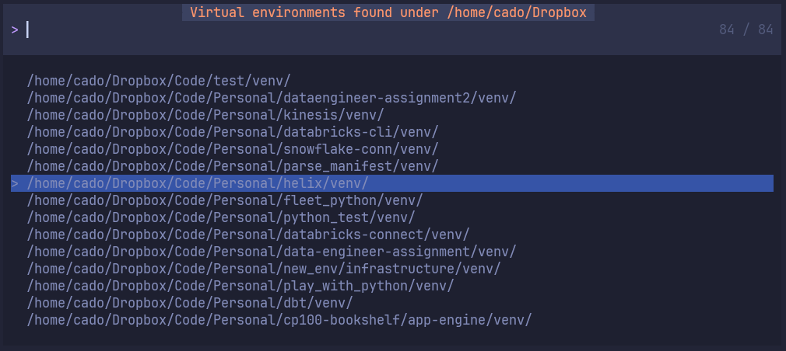

<p align="center">
  <h1 align="center">:tada: Python Venv Selector</h2>
</p>

<p align="center">
	A simple neovim plugin to let you choose what virtual environment to activate in neovim.
</p>

<p align="center">
    
</p>

# ⚡️ Features

Browse existing python virtual environments on your computer and select one to activate with pyright inside neovim.

- Plug and play, no configuration required
- Switch back and forth between virtual environments without restarting neovim
- Cached virtual environment that ties to your workspace for easy activation subsequently
- Requires [fd](https://github.com/sharkdp/fd) and
  [Telescope](https://github.com/nvim-telescope/telescope.nvim) for fast searches, and visual pickers.

## 📋 Installation and Configuration

**IMPORTANT**: The plugin works by using **pyright** lsp server, so pyright needs to be installed and pre-configured with nvim-lspconfig
before using this plugin. You can see example setup instructions here: https://github.com/neovim/nvim-lspconfig/blob/master/doc/server_configurations.md#pyright

### Using [folke/lazy.nvim](https://github.com/folke/lazy.nvim)

A minimal config looks like this and would typically go into your folder where you have plugins:

```lua
return {
	"linux-cultist/venv-selector.nvim",
	dependencies = { "neovim/nvim-lspconfig", "nvim-telescope/telescope.nvim" },
	config = true,
	event = "VeryLazy", -- Optional: needed only if you want to type `:VenvSelect` without a keymapping
}
```

Feel free to add a nice keymapping here as well:

```lua
return {
	"linux-cultist/venv-selector.nvim",
	dependencies = { "neovim/nvim-lspconfig", "nvim-telescope/telescope.nvim" },
	config = true,
	event = "VeryLazy", -- Optional: needed only if you want to type `:VenvSelect` without a keymapping
	keys = {{
		"<leader>vs", "<cmd>:VenvSelect<cr>",
		-- key mapping for directly retrieve from cache. You may set autocmd if you prefer the no hand approach
		"<leader>vs", "<cmd>:VenvSelect<cr>"
	}}
}
```

If you want to change the default options, you can add an opts table like this:

```lua
return {
	"linux-cultist/venv-selector.nvim",
	dependencies = {
		"neovim/nvim-lspconfig",
		"nvim-telescope/telescope.nvim",
		-- for DAP support
		"mfussenegger/nvim-dap-python"
		},
	config = true,
	keys = {{
		"<leader>vs", "<cmd>:VenvSelect<cr>",
		"<leader>vc", "<cmd>:VenvSelect<cr>"
	}},
	opts = {

		-- auto_refresh (default: false). Will automatically start a new search every time VenvSelect is opened.
		-- When its set to false, you can refresh the search manually by pressing ctrl-r. For most users this
		-- is probably the best default setting since it takes time to search and you usually work within the same
		-- directory structure all the time.
		auto_refresh = false,

		-- search_venv_managers (default: true). Will search for Poetry and Pipenv virtual environments in their
		-- default location. If you dont use the default location, you can
		search_venv_managers = true,

		-- search_workspace (default: true). Your lsp has the concept of "workspaces" (project folders), and
		-- with this setting, the plugin will look in those folders for venvs. If you only use venvs located in
		-- project folders, you can set search = false and search_workspace = true.
		search_workspace = true,

		-- path (optional, default not set). Absolute path on the file system where the plugin will look for venvs.
		-- Only set this if your venvs are far away from the code you are working on for some reason. Otherwise its
		-- probably better to let the VenvSelect search for venvs in parent folders (relative to your code). VenvSelect
		-- searchs for your venvs in parent folders relative to what file is open in the current buffer, so you get
		-- different results when searching depending on what file you are looking at.
		-- path = "/home/username/your_venvs",

		-- search (default: true) - Search your computer for virtual environments outside of Poetry and Pipenv.
		-- Used in combination with parents setting to decide how it searches.
		-- You can set this to false to speed up the plugin if your virtual envs are in your workspace, or in Poetry
		-- or Pipenv locations. No need to search if you know where they will be.
		search = true,

		-- dap_enabled (default: false) Configure Debugger to use virtualvenv to run debugger.
		-- require nvim-dap-python from https://github.com/mfussenegger/nvim-dap-python
		-- require debugpy from https://github.com/microsoft/debugpy
		-- require nvim-dap from https://github.com/mfussenegger/nvim-dap
		dap_enabled = false

		-- parents (default: 2) - Used when search = true only. How many parent directories the plugin will go up
		-- (relative to where your open file is on the file system when you run VenvSelect). Once the parent directory
		-- is found, the plugin will traverse down into all children directories to look for venvs. The higher
		-- you set this number, the slower the plugin will usually be since there is more to search.
		-- You may want to set this to to 0 if you specify a path in the path setting to avoid searching parent
		-- directories.
		parents = 2,

		-- name (default: venv) - The name of the venv directories to look for.
		name = "venv", -- NOTE: You can also use a lua table here for multiple names: {"venv", ".venv"}`

		-- fd_binary_name (default: fd) - The name of the fd binary on your system.
		fd_binary_name = "fd"

	}
	event = "VeryLazy", -- Optional: needed only if you want to type `:VenvSelect` without a keymapping
}
```

Or you can manually run the setup function with options like this:

```lua
return {
	"linux-cultist/venv-selector.nvim",
	dependencies = { "neovim/nvim-lspconfig", "nvim-telescope/telescope.nvim" },
	keys = {{
		"<leader>vs", "<cmd>:VenvSelect<cr>"
	}},
	config = function()
		require("venv-selector").setup({

		-- auto_refresh (default: false). Will automatically start a new search every time VenvSelect is opened.
		-- When its set to false, you can refresh the search manually by pressing ctrl-r. For most users this
		-- is probably the best default setting since it takes time to search and you usually work within the same
		-- directory structure all the time.
		auto_refresh = false,

		-- search_venv_managers (default: true). Will search for Poetry and Pipenv virtual environments in their
		-- default location. If you dont use the default location, you can
		search_venv_managers = true,

		-- search_workspace (default: true). Your lsp has the concept of "workspaces" (project folders), and
		-- with this setting, the plugin will look in those folders for venvs. If you only use venvs located in
		-- project folders, you can set search = false and search_workspace = true.
		search_workspace = true,

		-- path (optional, default not set). Absolute path on the file system where the plugin will look for venvs.
		-- Only set this if your venvs are far away from the code you are working on for some reason. Otherwise its
		-- probably better to let the VenvSelect search for venvs in parent folders (relative to your code). VenvSelect
		-- searchs for your venvs in parent folders relative to what file is open in the current buffer, so you get
		-- different results when searching depending on what file you are looking at.
		-- path = "/home/username/your_venvs",

		-- search (default: true) - Search your computer for virtual environments outside of Poetry and Pipenv.
		-- Used in combination with parents setting to decide how it searches.
		-- You can set this to false to speed up the plugin if your virtual envs are in your workspace, or in Poetry
		-- or Pipenv locations. No need to search if you know where they will be.
		search = true,

		-- parents (default: 2) - Used when search = true only. How many parent directories the plugin will go up
		-- (relative to where your open file is on the file system when you run VenvSelect). Once the parent directory
		-- is found, the plugin will traverse down into all children directories to look for venvs. The higher
		-- you set this number, the slower the plugin will usually be since there is more to search.
		-- You may want to set this to to 0 if you specify a path in the path setting to avoid searching parent
		-- directories.
		parents = 2,

		-- name (default: venv) - The name of the venv directories to look for.
		name = "venv", -- NOTE: You can also use a lua table here for multiple names: {"venv", ".venv"}`

		-- fd_binary_name (default: fd) - The name of the fd binary on your system.
		fd_binary_name = "fd"
		})
	end
	event = "VeryLazy", -- Optional: needed only if you want to type `:VenvSelect` without a keymapping
}
```

### Helpful functions

The selected virtual environment and path to the python executable is available from these two functions:

```
require("venv-selector").get_active_path() -- Gives path to the python executable inside the activated virtual environment
require("venv-selector").get_active_venv() -- Gives path to the activated virtual environment folder
```

This can be used to print out the virtual environment in a status bar, or make the plugin work with other plugins that
want this information.

## ☄ Getting started

Once the plugin has been installed, the `:VenvSelect` command is available.

This plugin will look for python virtual environments located close to your code.

It will start looking in the same directory as your currently opened file. Usually the venv is located in a parent
directory. By default it will go up 2 levels in the directory tree (relative to your currently open file), and then go back down into all the directories under that
directory. Finally it will give you a list of found virtual environments so you can pick one to activate.

### If you use Poetry or Pipenv

If you use Poetry or Pipenv, you typically have all the virtual environments located in the same path as subfolders.

VenvSelector automatically looks in the default paths for both Poetry and Pipenv virtual environments:

_Mac:_

- Poetry: `$HOME/Library/Caches/pypoetry/virtualenvs`
- Pipenv: `$HOME/.local/share/virtualenvs`

_Linux:_

- Poetry: `$HOME/.cache/pypoetry/virtualenvs`
- Pipenv: `$HOME/.local/share/virtualenvs`

_Windows:_

- Poetry: `%APPDATA%\\pypoetry\\virtualenvs`
- Pipenv: `$HOME\\virtualenvs`

You can override the default paths if the virtual environments are not being found by `VenvSelector`:

```
require("venv-selector").setup({
	poetry_path = "your_path_here",
	pipenv_path = "your_path_here"
})
```

#### Find out where your virtual environments are located

##### Poetry

First run `poetry env info` in your project folder where you are using poetry to manage the virtual environments. You
should get some output simular to this:

```bash
Virtualenv
Python:         3.10.10
Implementation: CPython
Path:           /home/cado/.cache/pypoetry/virtualenvs/poetry-demo-EUUW_nAM-py3.10
Executable:     /home/cado/.cache/pypoetry/virtualenvs/poetry-demo-EUUW_nAM-py3.10/bin/python
Valid:          True

System
Platform:   linux
OS:         posix
Python:     3.10.10
Path:       /usr
Executable: /usr/bin/python3.10

```

You can see that the path shows that the virtual environments are located under `/home/cado/.cache/pypoetry/virtualenvs` in this case.

Copy the virtualenv path and set it as a parameter to the `VenvSelector` setup function:

```
require("venv-selector").setup({
	poetry_path = "/home/cado/.cache/pypoetry/virtualenvs",
})
```

##### Pipenv

First run `pipenv --venv` in your project folder where you are using pipenv to manage the virtual environments. You
should get some output simular to this:

```bash
/home/cado/.local/share/virtualenvs/pipenv_test-w6BD3kWZ
```

You can see that the path shows that the virtual environments are located under `/home/cado/.local/share/virtualenvs` in this case.

Copy the virtualenv path and set it as a parameter to the `VenvSelector` setup function:

```
require("venv-selector").setup({
	pipenv_path = "/home/cado/.local/share/virtualenvs",
})
```

## Dependencies

This plugin has been built to be as fast as possible. It will search your computer for virtual environments while you
continue working, and it wont freeze the neovim gui while looking for them. Usually it will give you a result in a few seconds.

Note: You need [fd](https://github.com/sharkdp/fd) installed on your system. This plugin uses it to search for
the virtual environments as fast as possible.

Telescope is also needed to let you pick a virtual environment to use.

[nvim-python-dap](https://github.com/mfussenegger/nvim-dap-python) is required for DAP function. Enable DAP at config.
